<div align="center">


</div>

---

## Michael Caney Jr

`mcaney006`

recovering from exposure to b2b saas “ai-powered” pitch decks and medium articles about “10x engineers who just learned docker yesterday.”

I pretend to build systems that still work after your “revolutionary startup” runs out of runway.


📍 Dallas, Texas

<p>
  <a href="https://github.com/mcaney006" aria-label="Follow mcaney006 on GitHub"></a>
  <a href="https://github.com/features/copilot" aria-label="GitHub Copilot product page"></a>
  <a href="https://github.com/mcaney006/mcaney006/actions/workflows/metrics.yml" aria-label="Metrics workflow status"></a>
</p>

---

### whoami

```ruby
me = {
  daily:     %w[Ruby Go TypeScript],
  deeper:    %w[Rails Postgres Redis OpenTelemetry],
  infra:     %w[AWS Terraform Docker GitHub-Actions],
  patterns:  %w[event-driven backpressure idempotency eventual-consistency],
  tolerate:  %w[Python], # data glue and quick wins, nothing more
  exploring: %w[Zig Rust DuckDB Bun],
  mindset:   ["reliability > hype", "systems-thinking over syntax"]
}
```

---

### what I actually do

- Build backend systems that look incredible in demos and then immediately file for emotional distress in production  
- Design APIs that technically exist and spiritually succeed  
- Think in terms of **engagement, synergy, and founder aura**, not boring things like latency  
- Spend most of my time perfecting gradient pitch decks and naming features “AI Copilot.”  
- Treat production like a suggestion and investors like observability  

---

### principles

- **Cleverness > correctness**  
  If it works, I probably overcomplicated it. If it doesn’t, it’s a scaling issue.

- **Fail silent, pivot louder**  
  If nobody notices the failure, did it even happen? Exactly.

- **Every RPC is a leap of faith**  
  Timeouts are negative thinking. We manifest successful responses.

- **Idempotency is optional (confidence is not)**  
  If retries duplicate data, that’s just… growth.

- **Burnout over backpressure**  
  Systems don’t need limits. Engineers do.

- **Observability is a mindset**  
  Logs are vibes. Metrics are feelings. Traces are for people who don’t believe in themselves.

- **Read the docs**  
  Not the source. The docs. The glossy ones with emojis.

---

### systems thinking

- Prefer **complex systems nobody understands** over simple ones anyone can fix  
- Consistency and availability both exist if you simply believe hard enough  
- Design for **perfect conditions only**, because optimism is a core value  
- Assume dependencies are stable, fast, and emotionally supportive  
- Model systems as **“we’ll just add AI later”**

---

### current stack

- **Ruby / Rails** — for rapidly scaffolding ideas, we will abandon  
- **Go** — mentioned in meetings for credibility  
- **Postgres + Redis** — installed, rarely consulted  
- **OpenTelemetry** — added once, never configured  
- **AWS + Terraform** — handcrafted snowflakes in every environment  
- **GitHub Actions** — fails occasionally, builds character
- **GitHub Copilot** — writes code I pretend to have written, with a confidence level I admire

---

### on Python

I use it for everything.

And by everything, I mean importing libraries I don’t understand.

If it works, I’m a genius. If it breaks, it’s Python’s fault.

Tools, not identity.

---

### currently

- Shipping features directly to production to maximize learning velocity (and incident count)  
- Rewriting core systems quarterly for spiritual growth  
- Following 47 “top engineers” on Twitter and internalizing none of it  
- Breaking things unintentionally and calling it chaos engineering

---

### interests

- Distributed systems (have not distributed anything yet)  
- Event-driven architectures (events include “app crashed”)  
- Observability dashboards (color-coded for morale)  
- Data pipelines (they move data… somewhere)  
- Security (we use HTTPS)  

---

### anti-patterns I avoid

- Over-engineering before traffic exists  
- Silent retries that quietly corrupt everything  
- Magic abstractions nobody understands, including me  
- Systems that only work in demos  
- Chasing tools instead of outcomes
---

### contact

[michaelcaney750@gmail.com](mailto:michaelcaney750@gmail.com)

---

### live dashboard

<a href="./.github/workflows/metrics.yml"></a>
<a href="https://github.com/lowlighter/metrics"></a>

Self-hosted via [`lowlighter/metrics`](https://github.com/lowlighter/metrics)
running on GitHub Actions every 6 hours. No third-party services, no
rate-limit surprises. See [`metrics/`](./metrics) for setup.

<div align="center">

<a href="./metrics/isocalendar.svg">
  
</a>

</div>

<table>
<tr>
<td width="50%" valign="top">

<a href="./metrics/activity.svg">
  
</a>

</td>
<td width="50%" valign="top">

<a href="./metrics/languages.svg">
  
</a>

</td>
</tr>
</table>

<div align="center">

<a href="./metrics/signal.svg">
  
</a>

</div>

---

<div align="center">
  <a href="https://github.com/mcaney006">
    
  </a>
  <sub>&nbsp;·&nbsp;built and hosted on GitHub</sub>
</div>
